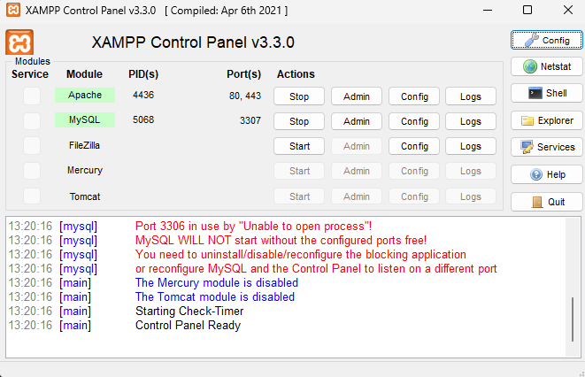

# Registro de problemas técnicos y soluciones (Troubleshooting Log)

Solo se documentan problemas que **realmente ocurrieron** durante el desarrollo, cada uno con su evidencia.

## Resumen

| # | Problema | Causa | Solución | Evidencia |
|---|---|---|---|---|
| 1 | MySQL no arranca en XAMPP: `Port 3306 in use by "Unable to open process"!` | El puerto 3306 estaba ocupado por otro proceso del sistema operativo. | Cambiar el puerto de MariaDB a 3307 en `my.ini`. | [Captura](img/xampp-puerto-3307.png) |
| 2 | `npm : No se puede cargar el archivo ...\npm.ps1 porque la ejecución de scripts está deshabilitada en este sistema` | La política de ejecución de PowerShell bloquea los scripts, y `npm` se lanza con un script `.ps1`. | `Set-ExecutionPolicy RemoteSigned -Scope CurrentUser` | Salida de la terminal (ver sección 2) |

---

## 1. MySQL no arranca por el puerto 3306 ocupado

**Síntoma.** Al pulsar *Start* en MySQL, el panel de XAMPP (v3.3.0) mostraba en el log:

```
Port 3306 in use by "Unable to open process"!
MySQL WILL NOT start without the configured ports free!
You need to uninstall/disable/reconfigure the blocking application
or reconfigure MySQL and the Control Panel to listen on a different port
```

**Causa.** Otro proceso del sistema ya estaba usando el puerto estándar 3306, así que MariaDB no podía escuchar en él.

**Solución.** En lugar de cerrar procesos del sistema a ciegas, se reconfiguró MariaDB para escuchar en otro puerto. En `xampp/mysql/bin/my.ini` se cambió el puerto a `3307` (secciones `[client]` y `[mysqld]`). Después se reinició el servicio y se actualizó el puerto en las conexiones (MySQL Workbench y la variable `DB_PORT` del backend).

**Resultado.** MySQL arranca en verde y escucha en el puerto 3307:



---

## 2. `npm` bloqueado por la política de ejecución de PowerShell

**Síntoma.** Al ejecutar `npm -v` en la terminal de VS Code (PowerShell), `git` y `node` funcionaban pero `npm` fallaba con:

```
npm : No se puede cargar el archivo D:\Program Files\nodejs\npm.ps1 porque la ejecución
de scripts está deshabilitada en este sistema.
    + CategoryInfo          : SecurityError: (:) [], PSSecurityException
    + FullyQualifiedErrorId : UnauthorizedAccess
```

**Causa.** La política de ejecución de scripts de PowerShell estaba restringida y `npm` se invoca mediante el script `npm.ps1`.

**Solución.** Permitir scripts firmados localmente, solo para el usuario actual (sin necesidad de ser administrador):

```powershell
Set-ExecutionPolicy RemoteSigned -Scope CurrentUser
```

**Resultado.** `npm -v` devuelve la versión (`11.19.0`) y `npm install` / `npm start` funcionan con normalidad.

---

## Plantilla para añadir nuevos problemas

Copiar este bloque solo cuando ocurra un problema real y guardar su captura en `docs/img/`.

```
## N. Título corto del problema
**Síntoma.** Qué se vio (mensaje de error exacto).
**Causa.** Por qué ocurría.
**Solución.** Qué se hizo exactamente (comandos / archivos modificados).
**Resultado.** Captura que demuestra que funciona.
```
